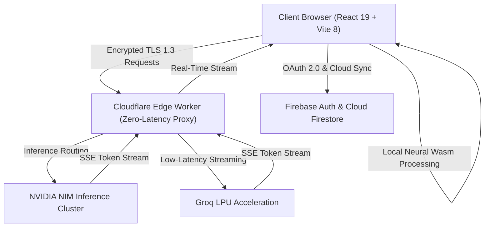

<div align="center">

# 🤖 SumanAI

### Next-Generation Multi-Model Intelligence & Cognitive Canvas Workspace

[](http://sumanai.sumanonline.com/)
[](https://github.com/SumanCH8514/SumanAI-Chat-Platform/releases/tag/v2.4.0)
[](https://react.dev/)
[](https://vitejs.dev/)
[](https://workers.cloudflare.com/)
[](LICENSE)

<p align="center">
  <strong>SumanAI</strong> is a high-throughput, privacy-first generative AI workspace engineered to eliminate latency and platform lock-in. Powered by <strong>Groq LPUs</strong>, <strong>NVIDIA NIM microservices</strong>, and <strong>Cloudflare Edge Workers</strong>, it combines instantaneous multi-model inference, an interactive split-view Canvas, client-side WebAssembly tools, and enterprise legal and support infrastructure.
</p>

<p align="center">
  🚀 <strong>Live Production URL:</strong> <a href="http://sumanai.sumanonline.com/"><strong>http://sumanai.sumanonline.com/</strong></a>
</p>

[Explore Models](#-model-registry--intelligence-tiers) • [Architecture](#-system-architecture) • [Getting Started](#-getting-started) • [Legal & Support](#-legal--support-portal) • [Changelog](CHANGELOG.md)

</div>

---

## ⚡ Key Highlights & Performance

| Metric | Benchmark | Description |
| :--- | :--- | :--- |
| **Stream Latency (TTFB)** | `< 200ms` | Instantaneous token streaming via Groq LPUs & NVIDIA NIM |
| **Model Ecosystem** | `10+ SOTA Models` | Seamless routing across reasoning, coding, vision, and speed tiers |
| **Image Processing** | `100% Local (Wasm)` | Client-side neural background removal with zero cloud transmission |
| **Privacy Pledge** | `Zero AI Training` | User prompts and outputs are never retained or sold for foundation training |
| **Authentication** | `Dual Access Tier` | Instant guest mode + persistent Google Cloud Firestore sync |

---

## 🧠 Model Registry & Intelligence Tiers

SumanAI dynamically routes conversational context to specialized foundation models based on user selection:

| Model ID | Provider Engine | Specialization | Access Tier |
| :--- | :--- | :--- | :--- |
| **`z-ai/glm-5.3`** | NVIDIA NIM | Advanced Cognitive Reasoning & Complex Problem Solving | Verified User |
| **`z-ai/glm-5.3-flash`** | NVIDIA NIM | Ultra-Fast Thought Processing & Rapid Iteration | Verified User |
| **`moonshotai/kimi-k3`** | NVIDIA NIM | Long-Context Document Analysis & Research Synthesis | Verified User |
| **`google/gemma-4-31b-it`** | NVIDIA NIM | Analytical Logic, Instruction Following & Math | Verified User |
| **`google/diffusiongemma-26b-a4b-it`** | NVIDIA NIM | Creative Writing, Brainstorming & Stylistic Generation | Verified User |
| **`meta/muse-glimmer-30b`** | NVIDIA NIM | High-Precision Code Engineering & System Design | Verified User |
| **`meta/llama-3.2-11b-vision-instruct`** | NVIDIA NIM | Multimodal Image Inspection, OCR & Visual QA | Verified User |
| **`qwen/qwen-2.5-32b`** | Groq LPU | General Purpose Chat, Low Latency & High Fluidity | Instant Guest |

---

## 🌟 Core Features

### 🎛️ Multi-Model Cockpit
- Toggle dynamically between foundation models without losing context or conversational state.
- Tailored access tiers allow immediate guest experimentation, while Google Authentication unlocks extended reasoning models and cloud sync.

### 🎨 Interactive Split-View Canvas
- Side-by-side workspace panel dedicated to live code blocks, markdown documents, and artifacts.
- Real-time syntax highlighting, copy actions, and sandboxed live code preview.

### 🖼️ Client-Side WebAssembly Background Remover
- Integrated neural image segmentation running directly in browser memory via WebAssembly and WebGL (`@imgly/background-removal`).
- Images never leave the client device, ensuring privacy and eliminating server upload wait times.

### 📱 Adaptive Mobile Engine
- Responsive glassmorphic UI built with solid CSS tokens and dynamic viewports (`dvh`).
- Touch-optimized AI model selector modal centered with backdrop filtering.
- Dynamic dropdown orientation inversion (`.dropdown-up`) preventing clipping on viewport boundaries.
- Responsive toast notification alignment: top-right on desktop, top-center on mobile.

### 🔒 Privacy Sovereignty & Data Portability
- **Zero Training Pledge**: Your personal prompts and files are strictly ephemeral and never used to train public models.
- **One-Click Data Portability**: Export complete chat histories in standardized JSON format at any time via Settings.
- **Instant Erasure**: Granular deletion of individual messages, entire threads, or complete account history from Cloud Firestore.

---

## 🏛️ System Architecture



---

## 📂 Repository Structure

```text
SumanAI/
├── CHANGELOG.md              # Semantic release notes and version history
├── README.md                 # Production architectural documentation
├── package.json              # Monorepo workspaces manifest (v2.4.0)
├── firestore.rules           # Granular Firestore cloud security rules
│
├── backend/                  # Cloudflare Edge Worker API Gateway
│   ├── index.mjs             # Multi-model proxy, streaming handlers & auth
│   ├── wrangler.toml         # Cloudflare Worker deployment configuration
│   └── package.json          # Worker runtime dependencies
│
└── frontend/                 # Client Single Page Application
    ├── index.html            # Entry HTML with meta & PWA headers
    ├── vite.config.js        # Vite 8 bundling & development config
    ├── package.json          # Frontend dependencies & scripts (v2.4.0)
    └── src/
        ├── App.jsx           # Root error boundary, modal & layout mounts
        ├── main.jsx          # StrictMode, HelmetProvider & AuthObserver
        ├── components/       # UI components (Sidebar, InputBar, Canvas, Modals)
        ├── context/          # ModelContext, ThemeContext providers
        ├── hooks/            # Custom hooks (useTheme, useModel)
        ├── layouts/          # MainLayout workspace wrapper
        ├── pages/            # View pages (ChatPage, ToolsView, BGRemover, Legal, Contact)
        │   ├── TermsOfService.jsx # Production Terms of Service
        │   ├── PrivacyPolicy.jsx  # Zero-training Privacy Policy
        │   ├── AboutUs.jsx        # Company vision, metrics & founder spotlight
        │   ├── ContactPage.jsx    # Interactive Support & Contact Portal
        │   └── LegalPage.css      # Shared responsive styling for legal/about views
        ├── routes/           # Declarative React Router 7 route definitions
        ├── services/         # Firebase, Firestore & streaming chat services
        ├── store/            # Zustand global state (useAuthStore, useChatStore)
        └── utils/            # Image processing, download & format utilities
```

---

## 🚀 Getting Started

### Prerequisites
- **Node.js**: v18.0.0 or higher
- **npm**: v9.0.0 or higher
- **Cloudflare Wrangler CLI** *(optional, for local worker proxy)*: `npm install -g wrangler`

### 1. Clone the Repository
```bash
git clone https://github.com/SumanCH8514/SumanAI-Chat-Platform.git
cd SumanAI-Chat-Platform
```

### 2. Install Dependencies
```bash
npm install
```

### 3. Configure Environment Variables

#### Frontend Environment
Create `frontend/.env` based on `frontend/.env_example`:
```env
VITE_WORKER_URL=http://localhost:8787
VITE_FIREBASE_API_KEY=your_firebase_api_key
VITE_FIREBASE_AUTH_DOMAIN=your_firebase_auth_domain
VITE_FIREBASE_PROJECT_ID=your_firebase_project_id
VITE_FIREBASE_STORAGE_BUCKET=your_firebase_storage_bucket
VITE_FIREBASE_MESSAGING_SENDER_ID=your_firebase_sender_id
VITE_FIREBASE_APP_ID=your_firebase_app_id
```

#### Backend Environment (Cloudflare Worker)
Create `backend/.dev.vars` based on `backend/.dev.vars.example`:
```env
NVIDIA_API_KEY=your_nvidia_nim_api_key
GROQ_API_KEY=your_groq_api_key
GEMINI_API_KEY=your_google_gemini_api_key
```

### 4. Run Locally
Launch the application with live Hot Module Replacement:
```bash
npm run dev
```
The application will be accessible at `http://localhost:5173`.

---

## 🛠️ Verification & Building

```bash
# Run ESLint across frontend code
npm run lint

# Build production bundle
npm run build --workspace=frontend

# Deploy backend to Cloudflare Edge
cd backend && npx wrangler deploy
```

---

## 🛡️ Legal & Support Portal

SumanAI is equipped with dedicated, production-ready legal and company documentation:

- [**Terms of Service**](file:///e:/Projects/React-Project/SumanAI/frontend/src/pages/TermsOfService.jsx) (`/terms` or `/terms-of-service`)
- [**Privacy Policy**](file:///e:/Projects/React-Project/SumanAI/frontend/src/pages/PrivacyPolicy.jsx) (`/privacy` or `/privacy-policy`)
- [**About SumanAI**](file:///e:/Projects/React-Project/SumanAI/frontend/src/pages/AboutUs.jsx) (`/about` or `/about-project`)
- [**Support & Contact Portal**](file:///e:/Projects/React-Project/SumanAI/frontend/src/pages/ContactPage.jsx) (`/contact` or `/support`)

For formal enterprise inquiries, security disclosures, or partnership discussions, reach our team directly at:  
📧 **[support_sumanai@sumanonline.com](mailto:support_sumanai@sumanonline.com)**

---

## 👨‍💻 Engineering & Authorship

- **Architect & Lead Developer**: [Suman Chakrabortty](https://github.com/SumanCH8514)
- **LinkedIn**: [Connect with Suman](https://www.linkedin.com/in/sumanchakrabortty8514/)
- **Repository**: [SumanCH8514/SumanAI-Chat-Platform](https://github.com/SumanCH8514/SumanAI-Chat-Platform)

---

## 📄 License

This project is licensed under the **MIT License** — see the [LICENSE](LICENSE) file for complete details.
